# Pokémon 151 - Twitch Plays Pokémon Edition

*A quick note on the title*: This is not a "Catch 'em all in one game" style ROM hack as the name might suggest.
This hack is built upon the actual, obscure ROM used during the very first Twitch Plays Pokémon run back in 2014: Pokémon 151 (Red hack) with some new homages.
An analysis of the ROM in question can be found here. [Reddit Post](https://www.reddit.com/r/twitchplayspokemon/comments/1yvzmu/analysis_of_the_151_rom/).

# Features

- Recreates the details of the original obscure ROM, including the modified title screen, SGB border, and the bugged/incomplete Vermilion City notice sign.
- Party sprites are customized and tied directly to the exact internal DVs of the original TPP team. Pokémon sharing those specific DVs (like AA-j the Zapdos) inherit unique sprites across the Status Screen, Wild Battles, and Hall of Fame.
- The Helix Fossil can now be used from your item menu to trigger completely random controller inputs (Up, Down, Left, Right, A, B, Start, Select).
- Post-Game Event: After beating 2 times the Elite Four, visit Bill's House to trigger a special event where Professor Oak returns ABBBBBBK( (Abby the Charmeleon) to your party, restoring the beloved Pokémon tragically lost to the PC early in the original run, complete with 1:1 stats and EVs/DVs matching.
- Full compatibility with the save file of the first TPP run. *(Note: This hack focuses strictly on the original run and does not consider later revisits).*

# Screenshots

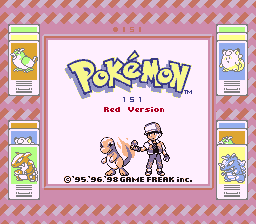
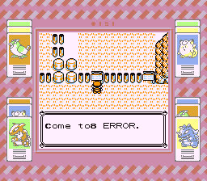
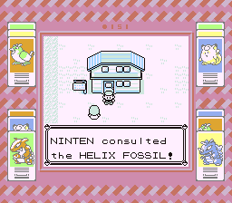
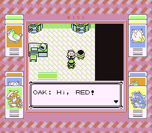
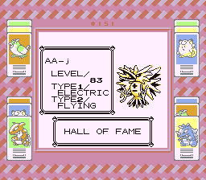

**Twitch Plays Pokémon team**

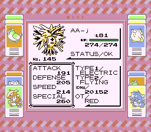
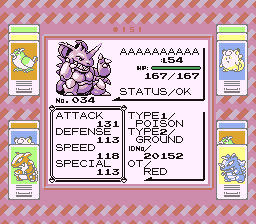
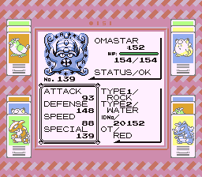
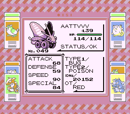
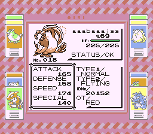
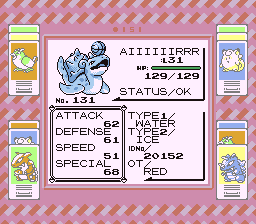

**Charmeleon recovered**

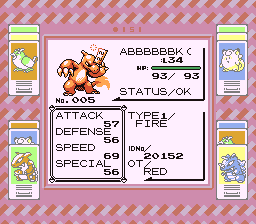
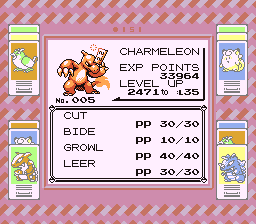

**Unique sprites feature: Same species, different DVs**

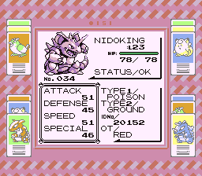

# Credits

**hamigakimomo**
- Unique sprites for Twitch Plays Pokémon

**pigdevil2010**
- Original idea for Helix Fossil as an usable item:
[Pokémon Red: TPP Special Edition wiki page](https://helixpedia.fandom.com/wiki/Pok%C3%A9mon_Red:_TPP_Special_Edition)
[Reddit](https://www.reddit.com/r/twitchplayspokemon/comments/2ahvtx/it_has_been_150_days_since_the_start_of_tpp_so/)
[Imgur showcase gallery](https://imgur.com/a/pok-mon-red-tpp-special-edition-dzdik)

**pret tutorials**
- Add debug mode to Red version
- Free some space in the Home BANK

# Pokémon Red and Blue [![Build Status][ci-badge]][ci]

This is a disassembly of Pokémon Red and Blue.

It builds the following ROMs:

- Pokemon Red (UE) [S][!].gb `sha1: ea9bcae617fdf159b045185467ae58b2e4a48b9a`
- Pokemon Blue (UE) [S][!].gb `sha1: d7037c83e1ae5b39bde3c30787637ba1d4c48ce2`
- BLUEMONS.GB (debug build) `sha1: 5b1456177671b79b263c614ea0e7cc9ac542e9c4`
- dmgapae0.e69.patch `sha1: 0fb5f743696adfe1dbb2e062111f08f9bc5a293a`
- dmgapee0.e68.patch `sha1: ed4be94dc29c64271942c87f2157bca9ca1019c7`

To set up the repository, see [**INSTALL.md**](INSTALL.md).

## See also

- [**Wiki**][wiki] (includes [tutorials][tutorials])
- [**Symbols**][symbols]
- [**Tools**][tools]

You can find us on [Discord (pret, #pokered)](https://discord.gg/d5dubZ3).

For other pret projects, see [pret.github.io](https://pret.github.io/).

[wiki]: https://github.com/pret/pokered/wiki
[tutorials]: https://github.com/pret/pokered/wiki/Tutorials
[symbols]: https://github.com/pret/pokered/tree/symbols
[tools]: https://github.com/pret/gb-asm-tools
[ci]: https://github.com/pret/pokered/actions
[ci-badge]: https://github.com/pret/pokered/actions/workflows/main.yml/badge.svg
